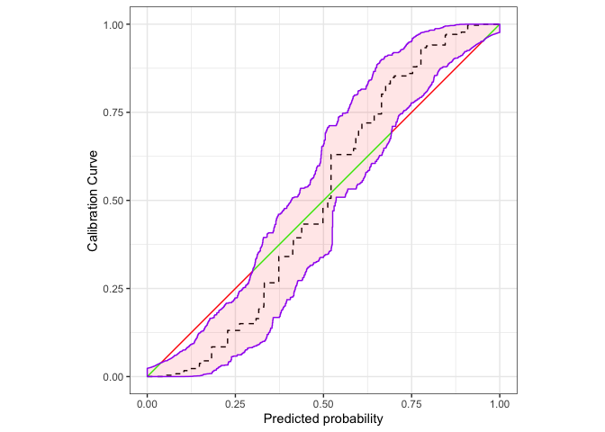

# calibrationbands

<!-- badges: start -->

[](https://github.com/marius-cp/calibrationband/actions)
<!-- badges: end -->

## Installation

### Development version

The most current version is available from GitHub.

``` r
# install.packages("devtools")
devtools::install_github("marius-cp/calibrationband")
```

## Example

``` r
library(calibrationband)
library(dplyr)

s=.8
n=10000
x <- runif(n)
p <- function(x,s){p = 1/(1+((1/x*(1-x))^(s+1)));return(p)}
dat <- tibble::tibble(pr=x, s=s, cep = p(pr,s), y=rbinom(n,1,cep))%>% dplyr::arrange(pr)

cb <- calibration_bands(x=dat$pr, y=dat$y,alpha=0.05, method = "round", digits = 3)
print(cb)
```

<!-- -->

    #> Areas of misscalibration (ordered by length). In addition there are 3 more. 
    #> # A tibble: 6 × 2
    #>    min_x max_x
    #>    <dbl> <dbl>
    #> 1 0.0344 0.300
    #> 2 0.759  0.946
    #> 3 0.946  0.946
    #> # … with 3 more rows

    # customize autoplot using layers 
    autoplot(cb,approx.equi=500, cut.bands = F,p_isoreg = NA,p_ribbon = NA,p_diag = NA)+
      ggplot2::autolayer(
        cb,
        cut.bands = F,
        p_diag = list(low = "green", high = "red", guide = "none", limits=c(0,1)),
        p_isoreg = list(linetype = "dashed"),
        p_ribbon = list(alpha = .1, fill = "red", colour = "purple")
                         )

<!-- -->
